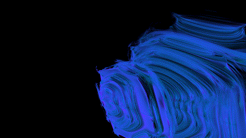

4DCraft
=====

A 4D fractal explorer run by the Godot Engine.

The album tab can be used to capture POIs and/or for sprites in 2D games.

From the album tab, more sophisticated imagery can be generated:
* Poster: A bigger version of the album item.
* Portrait: A 3D view image.
* Movie: A series of Portraits.

A "find time" functionality can be found in the Slice tab.
It looks for the optimal orientation of the time axis, in the current region
(=position and zoom).

Modes and Dimensions
=====

The default "perturbation" mode extends the MB fractal to 4D treating the
perturbation parameter as 2 additional coordinate axes.

"mandelbulb_xperturbation" does the same using a Mandelbulb formula, but
perturbing only on the first axis since Mandelbulb already provides 3
dimensions.

"mbx_2025" and "squared_minus_others_squared" are formulae made up by Taiten.

Other Mandelbrot-like formulae can be implemented using the custom code mode.
The best way to approach this is by copying the code from one of the included
modes from Calculation/Modes/*.glslinc.
